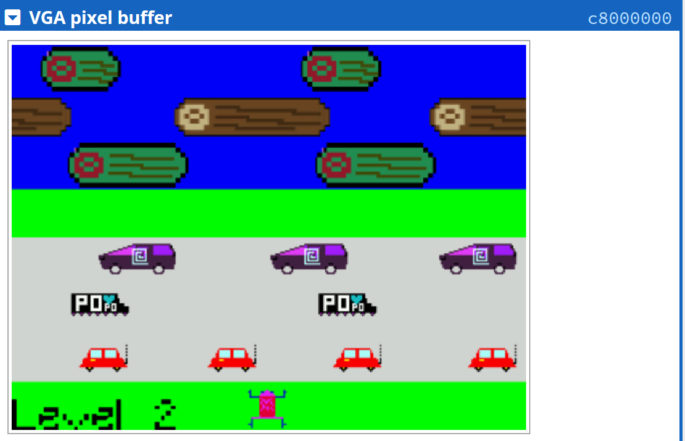
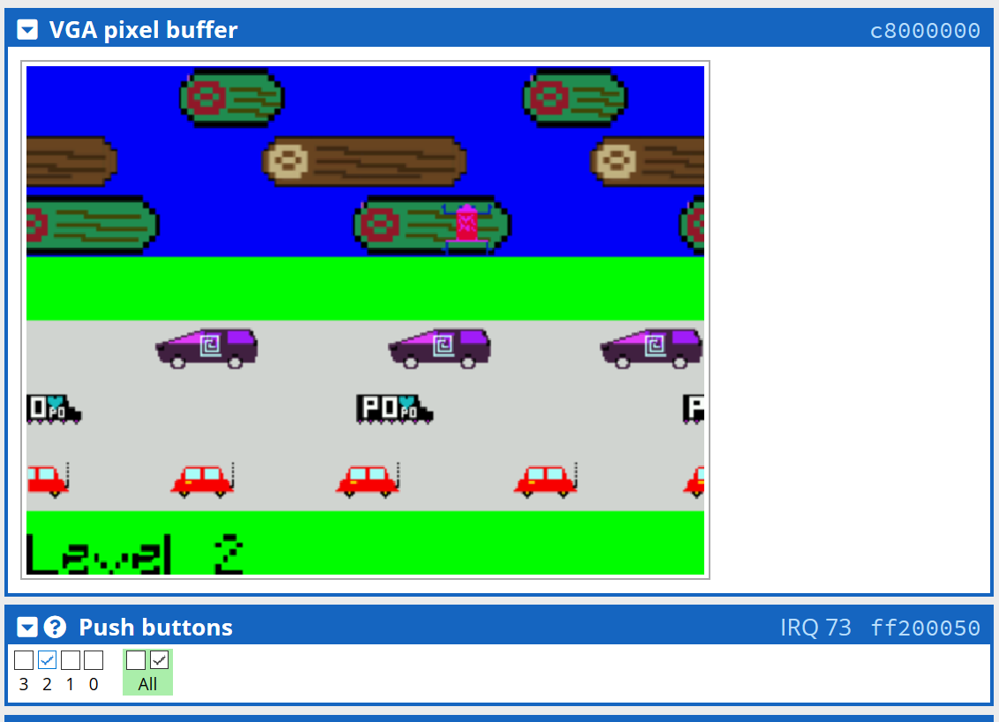

# Frogger
This a recreation of the classic arcade game frogger written in C.
- This game is meant to be run on a [DE1-SoC board](https://www.terasic.com.tw/cgi-bin/page/archive.pl?Language=English&No=836).
- It has been tested to run on an online .
- This was a 2 person project. My partner  made the sprites and wrote the functions which are called when a sprite needs to be drawn on screen. I wrote the code which handles gameplay and animation.

## Using The Simulator
- Set the "language" option to C once the website is open. 
- Turn off "Device-specific warnings". Otherwise, a warning will be trigger when you run the game, causing it to stop. This warning has been accounted for 
and it falls within expected behaviour of the game.
- Upload the game file and click on "Compile and Load".
- Click on "Continue".
- Move the "VGA pixel buffer" tab to the top of the side panel and place the "Push button" tab underneath it.

## Controls
Move the frog on the screen by pressing and **unpressing** the "Push button" keys. 
Use KEY0 to move the frog right, KEY1 to move the frog left and KEY2 to move the frog forward.
KEY3 will continue the game after you win or lose.
The game screen will appear in the VGA pixel buffer tab if you are using the simulator.

## Gameplay

The goal is to move the frog to the top of the screen. The moving cars act as obstacles. **If the frog touches one of these cars, you will lose a life**. After the second green horizontal strip, there are moving logs. The frog has to get on one of these logs to advance. **If the frog gets on one of these logs, it will move along with it (at the same speed)**. If the frog misses the log and lands on the water instead, you will lose a life. Each time you lose a life, you will start at the bottom of the screen. Please note that we’ve added slight tolerances to hit boxes so that you don’t always have to land the full frog on the log. This was done to make the game easier. 

Each time you advance to the top of the screen, you will also advance to a newer level. As you progress through levels, the moving objects will get slightly faster, making the game harder as you progress. You have to pass level 5 to win the game. You only have 3 lives to do so (displayed on the LEDR lights). If you lose your 3 lives, you will go back to level 1. Please press KEY3 each time you lose a life or advance to a new level to continue playing.

## Special Features
- The number of lives left are displayed on the LED (LEDR2-0) lights.
- The game uses a **double buffer** for animation and redrawing only occurs over the elements that need to be redrawn (instead of clearing the whole screen, which would be slower).
This allows for **smoother animations** with minimal framerate stutter.
- The moving elements (logs and cars) will wrap around the screen and be drawn partially if the sprite passes the edge.
Everything is still being drawn in (0<x<319). This ensures gameplay continuity and error free drawing.
- Usage of edge capture bits in the keys ensures that no key press goes undetected.

